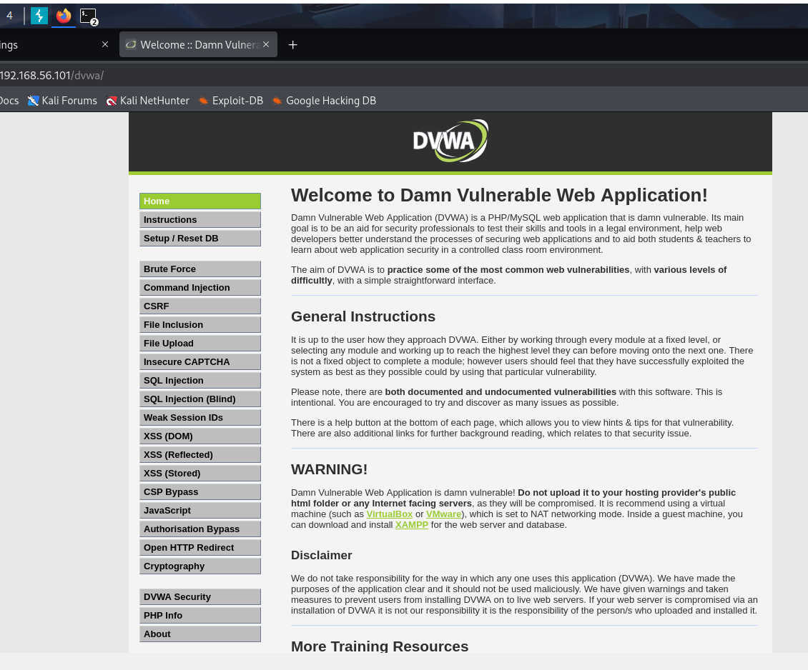
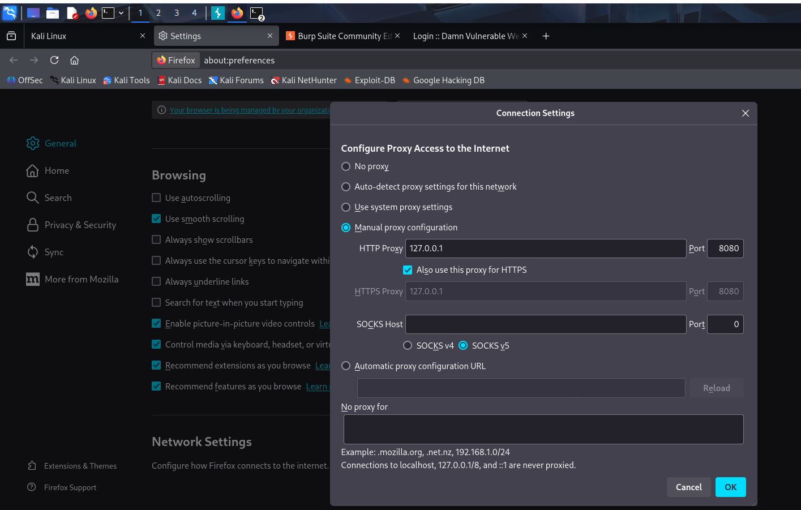
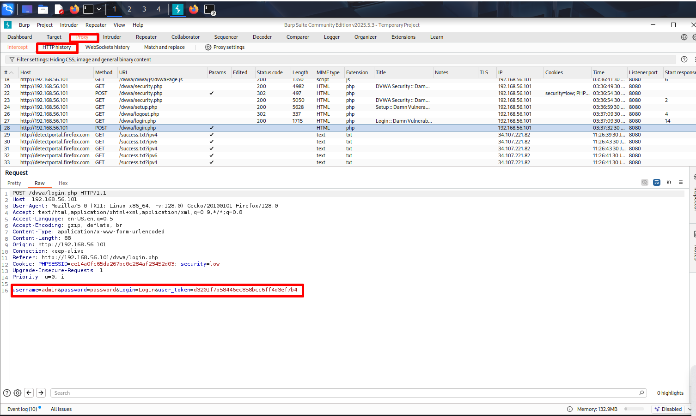
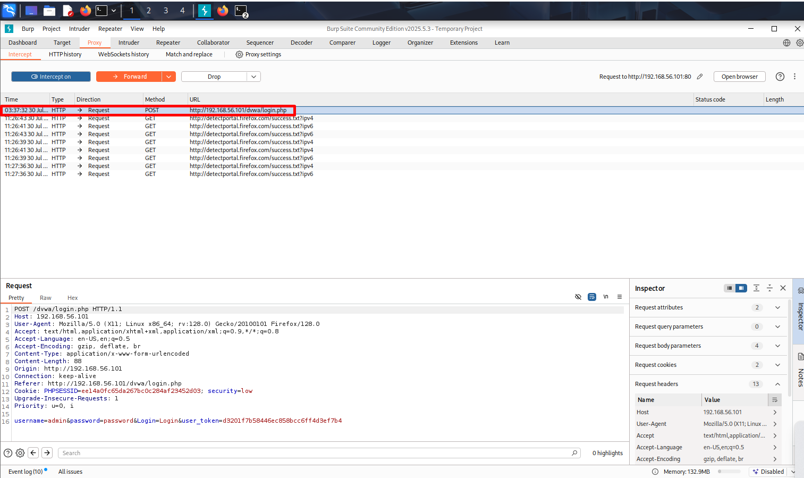

# Day 6 – DVWA Setup & Burp Suite Lab

## 🛠️ Lab Goals
- Install and configure DVWA on local Kali/Apache server
- Connect DVWA to MariaDB with new user
- Use Burp Suite to intercept login request
- Analyze HTTP traffic using Proxy and Repeater

## ✅ Achievements
- MariaDB configured with `dvwauser`
- DVWA accessible at `http://192.168.56.101/dvwa`
- Login traffic captured using Burp Proxy
- 302 response verified via Burp Repeater

## 📸 Screenshots
(Saved in screenshots/)
## Screenshots

### DVWA Page

### Burp Proxy Config

### Burp Repeater

### POST Intercept

## ⚠️ Issues Faced
- No POST request captured initially due to page load issue

