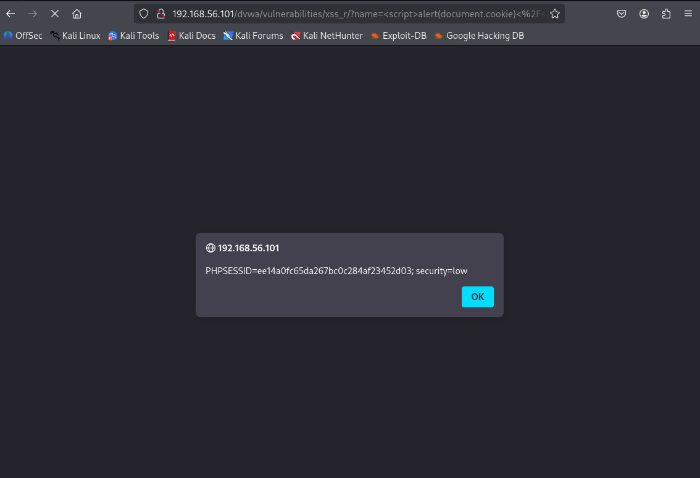

# Manual XSS Testing – DVWA

## 🎯 Target
- DVWA Reflected XSS module  
- URL: `http://192.168.56.101/dvwa/vulnerabilities/xss_r/`

## 🔍 Steps
1. Set DVWA to Low Security via `security.php`
2. Access XSS (Reflected) module
3. Test payloads:
   - `` ✅ Triggered
   - `` ✅ Triggered  
   - `` ✅ Triggered
4. Observed alert popups as confirmation (Firefox browser)

## ✅ Result
- XSS vulnerability confirmed  
- Reflected input successfully executed

## 🖼 Screenshot

